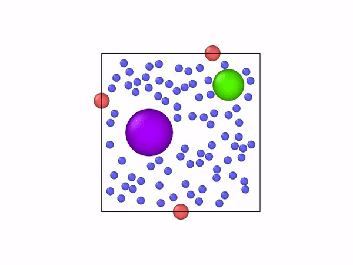

# Room_Evacuation

Preliminary Results for paper "Deep reinforcement learning with a particle dynamics environment applied to emergency evacuation", which is currently under review.

Related source code with be upload once it is published.

A sample case of room evacuation where agents(blue) find the shortest time to the exits(red) by avoiding the obstacles (magenta and green)

